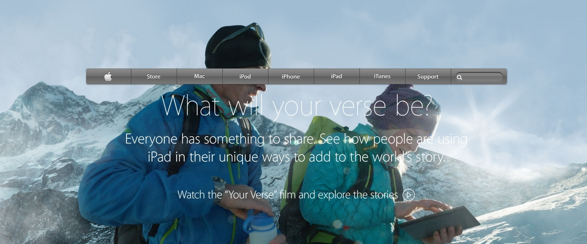

# apple-clone
Attemptting to recreate an old Apple page.
Project: building with Backgrounds and Gradients

<!-- PROJECT SHIELDS -->
<!--
*** I'm using markdown "reference style" links for readability.
*** Reference links are enclosed in brackets [ ] instead of parentheses ( ).
*** See the bottom of this document for the declaration of the reference variables
*** for contributors-url, forks-url, etc. This is an optional, concise syntax you may use.
*** https://www.markdownguide.org/basic-syntax/#reference-style-links
-->
[![Contributors][contributors-shield]][contributors-url]

<!-- PROJECT LOGO -->
 

  

  <h3 align="center">Apple page clone</h3>

  

    An attempt at recreating an old landing page of Apple 
    (https://web.archive.org/web/20140301004610/http://www.apple.com/)
     
    <a href="https://github.com/RodolfoRodriguezMata/apple-clone"><strong>Explore the docs »</strong></a>
     
     
    <a href="https://raw.githack.com/RodolfoRodriguezMata/apple-clone/index.html

">View Demo</a>
    ·
    <a href="https://github.com/RodolfoRodriguezMata/apple-clone/issues">Report Bug</a>
    ·
    <a href="https://github.com/RodolfoRodriguezMata/apple-clone/issues">Request Feature</a>
  

<!-- TABLE OF CONTENTS -->
## Table of Contents

* [About the Project](#about-the-project)
* [Built With](#built-with)
* [License](#license)
* [Contact](#contact)

<!-- ABOUT THE PROJECT -->
## About The Project

Built for Microverse following these requirements:
#### nav
- [x] built with gradient
- [x] use a main background image for all the icons
- [x] search bar "indented" into the nav

#### main body of the page
- [x] hero image as background
- [x] text within image made up of empty spans with background svg for text
- [x] 4 "cards" with background images as aside

#### footer

- [x] divided into disclaimer and links sections
- [x] aligned with flexbox

and following this lesson :
https://www.theodinproject.com/courses/html5-and-css3/lessons/building-with-backgrounds-and-gradients

[![Product Name Screen Shot][product-screenshot]](./images/snapshot.jpg)

## Built With
* (HTML5)
* (CSS3)
* Lucida Grande font

<!-- LICENSE -->
## License

Distributed under the MIT License. See `LICENSE` for more information.

<!-- CONTACT -->
## Contact

Rodolfo Rodriguez Mata - [Github profile](https://github.com/RodolfoRodriguezMata)

Project Link: [https://github.com/RodolfoRodriguezMata/apple-clone](https://github.com/RodolforodriguezMata/apple-clone)

